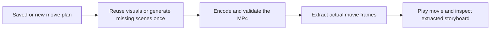
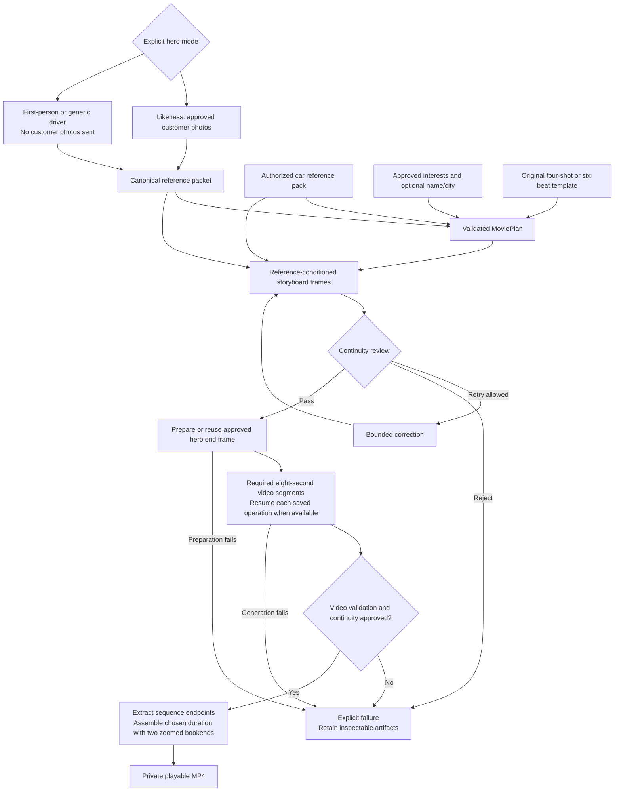
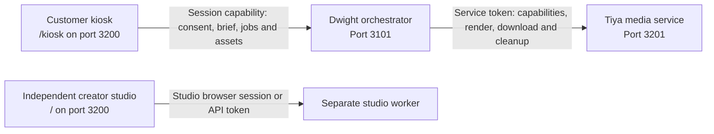

# Magic Pitch Robot - Movie Magic

Tiya's reference-led movie studio and showroom kiosk for MagicPitch. The creator studio builds personalized films from approved references; the kiosk follows Dwight's shared robot session. A separate authenticated media service accepts Dwight's complete advertisement briefs.

[Magic Pitch Robot overview](../README.md) | [System architecture and design](../docs/architecture.md) | [Teammate integration](integration/README.md)

**Dwight / Damian:** start with the [integration handoff](integration/README.md) and the authoritative [Dwight v1 bundle](integration/dwight/TIYA.md). The creator-studio API and orchestrator/media-service protocol are distinct; never exchange their URLs or credentials.

| Surface | Local address | Authentication | Start |
|---|---|---|---|
| Creator studio | `http://127.0.0.1:3200/` | Local browser session or `MOVIE_API_TOKEN` | `npm run dev` plus `npm run worker` |
| Showroom kiosk | `http://127.0.0.1:3200/kiosk` (Windows tablet/desktop) | One-time operator code, then in-memory session capability | Integrated launcher; use the same Windows tablet for the local Bluetooth bridge or a trusted HTTPS customer display; see [setup](../docs/showroom-https.md) |
| Dwight-to-Tiya media service | `http://127.0.0.1:3201` | Server-only `MEDIA_SERVICE_TOKEN` | `npm run media-service` |

The kiosk never calls the media service or receives a model/provider/service credential. A tablet on another device requires agreed authenticated LAN hosting, exact allowed origins, and trusted HTTPS for browser capture. These local URLs are not remotely deployed services.

### The robot's face

`/kiosk` is the portrait-first, edge-to-edge green robot face, not a dashboard.
The safe-area-aware shell fills the dynamic viewport in portrait and landscape.
**Stop robot**, microphone mute, camera status and **End session** stay reachable,
including during inline film playback. **Pause animation** is a separate operator
control, never a physical stop. Use **Toggle fullscreen** where supported, or
Windows Chrome/Edge installation for kiosk mode. No private session/media service worker
or browser-persisted capability is installed.

After one-time operator pairing, the customer explicitly enables live microphone
streaming. The face uses RobotPart's shared OpenAI Live/WebRTC transport,
preserving its full-duplex voice and barge-in; it never falls back to browser
speech synthesis. Captions follow real transcript deltas and the mouth follows
remote audio samples, not a speaking timer. **Continue by touch** exposes one
question at a time. Typed tool actions and touch share `ShowroomController`;
approvals bind the exact current readback, revision, fingerprint and expiry.
Transcript fragments and silence are not approval events.

Photography starts only after explicit photography, likeness and provider-transfer
consent is recorded by FinalProject. Local MediaPipe face and pose models quietly
collect one to four different views with lighting, blur, stability and duplicate
gates. There is no countdown or mandatory approval for each shot. **Photos &
camera** offers pause/resume, normalized JPEG/PNG upload, review and remove/retake.
Each photo is limited to 5 MiB, the set to 20 MiB; the front face is preferred as
primary. Multiple people, lost tracking or hidden presentation pause local
activity. Movie approval freezes the references; later conversation never
silently rerenders the movie. Run `npm run assets:showroom` once to prepare the
local face, pose and WASM files before camera use.

The Windows tablet may use Web Bluetooth only on the separate local
`/robot-bridge` operator page, opened from loopback Windows Chrome/Edge. The
bridge must be paired, armed with rear clearance, and the customer must approve
a bounded reverse framing intent. Execution uses a newly measured local tracking
sample after approval. The bridge owns pulse/cumulative caps and its watchdog.
**Stop requested** is distinct from a fresh bridge stopped report, which still
is not a physical hardware acknowledgement.

The fixed same-origin `/api/showroom` gateway uses the canonical
[showroom-v1 contract](integration/dwight/showroom-v1/README.md). Playback is
offered explicitly, checks the authorized MP4 length and SHA-256, pauses live
audio/capture, and sends `playback_started` only from the browser's `playing`
event. Only `ended` enables post-movie scheduling. Calendar readback includes
the exact 60-minute time, timezone, location and invitees before confirmation.
Ending/revoking clears local tracks and blob URLs and requests server cleanup;
it does not cancel a confirmed appointment.
An uncertain appointment uses **Check original appointment result** to replay
only its exact previously approved confirmation; it never creates a replacement
invitation. Lost replies reuse the original action or upload identity. A definite
revision-conflict rejection requires a refreshed upload attempt instead. Local
withdrawal immediately aborts media and remains in force even if a stale server
snapshot still contains the old consent.

The old `KioskController`, guide and local-demo narrator remain isolated for
legacy callers and regression coverage; the active `/kiosk` does not use them.
Tests use injected transports, media and fixtures, never a real camera, paid
provider or hardware. Actual Windows tablet permissions, voice and supervised
Bluetooth hardware still require operator acceptance on the target devices.

The full studio API supports private orchestrator sessions without changing the creator UI or the separate dedicated media-service contract. Send `Authorization: Bearer MOVIE_API_TOKEN` and `x-movie-session-id` on **every** upload, job, receipt and asset request. The scope must contain 1-128 ASCII letters, digits, `_` or `-`; it partitions the machine principal. Browser cookies cannot select that scope. Keep the token server-side and use the existing loopback-only API.

| Operation | Route | Result |
|---|---|---|
| Upload 1-4 originals | `POST /api/movie-assets`, multipart `photos` and JSON `consent`, plus `Idempotency-Key` | Existing `assets` plus durable `receipt` |
| Reconcile upload | `GET /api/movie-upload-batches/{key}` | `{receipt, assets}`; assets are populated only for a completed upload |
| Reclaim upload | `DELETE /api/movie-upload-batches/{key}` | Cancelled batch receipt; 202 while references are still in use, 200 after deletion |
| Submit full studio request | `POST /api/movie-jobs` | Unchanged canonical `JobRequest` and acceptance |
| Reconcile submission | `GET /api/movie-job-requests/{idempotency_key}` | `{receipt: {jobId, fingerprint, cancelledAt?, assetsDeleted?}}` |
| Cancel before or after submission | `DELETE /api/movie-job-requests/{idempotency_key}` | Durable tombstone even when no job exists yet; 202 pending, 200 settled |
| Cancel known job | `POST /api/movie-jobs/{jobId}/cancel` | Same cancellation receipt |

Receipt keys use the same bounded identifier alphabet as session scopes. Upload fingerprints bind normalized ordered photo bytes and consent; job fingerprints bind the complete canonical request. Reuse the original key and exact input to reconcile a lost response; never invent a replacement key after an uncertain paid submission. Cancelled keys cannot be reused, including after restart or an explicit retry/designer decision.

Upload receipts allocate IDs before any photo is saved, allowing partial/orphaned batch cleanup. Delete the job by key first, then its upload batch. Retry a pending or failed cleanup with the same keys. Cancellation is observed by the separate worker process and reaches existing provider calls and the owned encoder through its abort signal. `assetsDeleted: true` is not published until local worker execution and artifact writes have settled and all owned job copies are removed. It does not assert deletion from a model provider's retention systems or cancellation of an already accepted remote billing operation. Other jobs' references and shared catalog assets are never deleted. Ordinary terminal-job deletion retains its existing creator workflow.

The studio defaults to **reviewed storyboards with required Google Veo animation**. Astra handles vision/direction, Flare creates the reference stills, and Veo creates one to three eight-second moving clips after approval. Pan/zoom animation of a photograph does not satisfy the animation requirement.

Before spending a Veo attempt, run `npm run veo:check`. This no-charge preflight verifies that the configured Gemini API key can see the selected Veo 3.1 model and that it advertises long-running video generation. It cannot verify paid-tier billing, remaining quota/capacity, or whether a particular prompt and reference pair will pass Google's safety review; confirm billing and project-specific Veo limits in Google AI Studio. Movie Magic submits the supported first/last-frame profile explicitly: one 8-second 16:9 720p video, approved 1280x720 endpoints, adult-person generation, native audio, and prompt enhancement.

New Veo takes pause after storyboard approval and before any paid video submission. In the creator studio, mark two different approved storyboard cards with **Use as hero start** and **Use as hero end**, then continue the saved movie. Those exact owned 1280x720 images become Veo's first and last frames. The choices are durable and revision-checked; they cannot be changed after a Veo operation is attempted.

The default final cut is **15 seconds: a 3-second opening zoom, 8 seconds of real generated video, and a 4-second closing zoom**. The two bookend images are extracted from the approved video's exact first and last normalized frames. There are no still-only shots in the middle. The four/six-shot storyboard remains the approved reference plan, not a promise to insert every reference image into this cut. The studio sends `render_layout: "video-bookends"`; API callers omitting it retain the legacy storyboard layout.

**Movie length is independent of the reference story arc.** Choose 13, 15, 18, 23, or 28 seconds:

| Movie length | Opening zoom | Genuine animation | Closing zoom | Video clips |
|---|---|---|---|---|
| 13 seconds | 2 seconds | 8 seconds | 3 seconds | 1 |
| 15 seconds (default) | 3 seconds | 8 seconds | 4 seconds | 1 |
| 18 seconds | 1 second | 16 seconds | 1 second | 2 |
| 23 seconds | 3 seconds | 16 seconds | 4 seconds | 2 |
| 28 seconds | 2 seconds | 24 seconds | 2 seconds | 3 |

Longer cuts generate additional footage; they do not repeat a clip, slow it down, freeze it, or lengthen intermediate stills. Each continuation starts from the preceding approved clip's final frame. More video submissions and reviews can increase cost and production time. The selected duration is frozen with the request as `movie_duration_seconds`; changing the form does not change an existing movie or retry.

`davici.ai` is a parked domain; the similarly named `davinci.ai` is a media platform, but a supported developer API has not been verified. No customer images or credentials are sent there. The supplied prerecorded example can be used for the default demo independently of a generation provider.

The explicitly selected **Image motion only** alternative creates an animated-image MP4 and extracts its storyboard afterward. It is not genuine video-model footage; existing image-motion results retain that label.



No image is labeled continuity-approved merely to make this path succeed. Extracted frames carry `source: "extracted"`, their actual timestamps, and `NOT_REVIEWED` continuity metadata. Invalid media and provider errors still fail explicitly. If extraction fails after encoding, the movie is retained and available; retry extracts the storyboard without paying to regenerate scenes.

The default **Review every storyboard shot first** workflow requires visual approval before video generation and rendering:



The original customer and car images accompany generation; text notes never replace them. Visual review is a quality assessment, not identity verification or a guarantee of exact likeness.

Four original templates are included:

| Template | Direction |
|---|---|
| `VELOCITY` | Confident, sleek, controlled action-car cinematography |
| `TOMORROW_DRIVE` | A present-day departure becomes an imagined future destination |
| `DREAM_ROUTE` | A warm lifestyle journey toward an approved personal interest |
| `HERO_OF_THE_DAY` | Tiya's warm, human story about showing up for what matters |

The four-shot reference plan has beats lasting 3, 3, 8, and 4 seconds. Explicit `story_format: "six-shot"` selects Tiya's ordinary moment / spark / crossing over / impossible / mastery / payoff arc: 3, 3, 2, 8, 3, 4 seconds, or 3, 3, 3, 8, 3, 4 for `HERO_OF_THE_DAY`. These remain the reference-plan timings. **Either reference format can use any supported movie length; the default is 15 seconds.** API callers omitting `render_layout` retain the legacy 18-, 23-, or 24-second storyboard-layout movie.

Output is 1280x720, 16:9, 24 fps. In the bookend layout, the generated sequence supplies all middle footage and both bookend images; the original approved storyboard is retained separately. Legacy storyboard-layout hybrids replace only the hero shot (third in classic, fourth in six-shot). Output metadata identifies `image-motion`, `storyboard-motion`, or `hybrid-video`; `renderLayout: "video-bookends"` identifies the composition, and `durationSeconds` reports the actual selected runtime.

Hero modes are explicit, not automatic likeness-failure fallbacks: `LIKENESS` uses approved customer photos; `POV` shows a first-person view without the customer's face; `PERSONALIZED` uses a generic driver from behind or in silhouette. Non-likeness modes do not upload or transmit customer photos.

## Local setup

Node.js 24.11.0 is recommended, matching the orchestrator setup; the MoviePart package declares Node.js 22 or newer. From this folder:

```powershell
npm ci
if (-not (Test-Path .env)) { Copy-Item .env.example .env }
```

Edit `.env` locally. For the default studio workflow, configure both providers:

```dotenv
OPENAI_API_KEY=your-private-key
OPENAI_VISION_MODEL=gpt-6-astra
OPENAI_DIRECTOR_MODEL=gpt-6-astra
OPENAI_IMAGE_MODEL=gpt-image-2.5-flare
GEMINI_API_KEY=your-private-google-key
VEO_MODEL=veo-3.1-generate-preview
```

These are explicit example model choices, not a promise of account access. Select vision/text models your account actually supports; if those two settings are omitted, the current services fall back to `gpt-4.1`. The image adapter uses reference-conditioned editing. Account access, organization verification, quota, and current provider policy may prevent a real request even when a key is configured. Readiness indicates local configuration, not a paid account probe. `GOOGLE_API_KEY` is accepted as an alternative to `GEMINI_API_KEY`; a nonempty `GEMINI_API_KEY` takes precedence.

The [example environment file](.env.example) lists the supported operator settings:

| Settings | Purpose |
|---|---|
| `CONTINUITY_POLICY`, `STORYBOARD_MAX_ATTEMPTS`, `STORYBOARD_CONCURRENCY` | Default `practical`, 8 attempts, 2 concurrent shot tasks; allowed policies are `practical`/`strict`, attempts 1–20, concurrency 1–4 |

When Google Veo fails before returning an operation ID or rejects a completed clip during continuity review, the job stops and preserves approved storyboard work. The creator may explicitly authorize at most two replacement Veo submissions; a missing operation ID means the prior request may also have been accepted and charged. The worker never queues a replacement automatically and never switches a Veo job to Sora. After continuity-rejected replacements are exhausted, image-motion fallback remains a separate operator-approved option.
| `MOVIE_DATA_DIR` | Use `.movie-data` for the private studio/worker root; the separate media service stores its state below `media-service` within this root |
| `MOVIE_API_TOKEN`, `MOVIE_STUDIO_URL` | Optional machine/CLI access and its destination, default `http://127.0.0.1:3200`; not kiosk or media-service credentials |
| `FFMPEG_PATH`, `FFPROBE_PATH` | Optional absolute executable overrides; leave unset to use bundled binaries |
| `MOVIE_MUSIC_PATH` | Optional licensed local music bed; native generated-video audio works without it |
| `OPENAI_VIDEO_MODEL` | Optional Sora selection, default `sora-2-pro`; setting it does not switch the studio away from Veo |
| `MEDIA_SERVICE_TOKEN`, `MEDIA_SERVICE_PORT`, `MEDIA_SERVICE_JOB_TIMEOUT_MS` | Separate server-to-server service: private token, port 3201, 600000 ms timeout (10 minutes) |

Use a nonempty `MOVIE_DATA_DIR`; the studio and media-service entry points handle empty values differently. Leave unused executable overrides commented out rather than assigning empty strings, particularly when running the media service. No `NEXT_PUBLIC_*` provider credentials are needed. Layout and duration are request settings (`render_layout` and `movie_duration_seconds`), not `.env` settings.

Storyboard request options depend on the image model. GPT Image 2.x, including `gpt-image-2.5-flare`, is sent a native 16:9 size without `input_fidelity`; the endpoint rejects that legacy parameter for Flare. GPT Image 1/1.5 uses the supported landscape size and high input fidelity; GPT Image 1 Mini omits the fidelity parameter. Final frames are normalized to 1280x720 without stretching or cropping the references. A parameter-rejection error is not a billing failure.

### OpenAI billing and rate-limit failures

HTTP 429 does not always mean temporary throttling. `credit_balance_exhausted` means the API organization has no prepaid credits left; add credits in [OpenAI API billing](https://platform.openai.com/settings/organization/billing). Project/organization spend limits and approved usage limits have separate error codes and recovery instructions. Changing the model or repeatedly clicking Create does not restore exhausted credits.

For a genuine `rate_limit_exceeded` or `slow_down` response, wait for the reported retry interval when available and reduce request frequency. The app reports these separately from billing failures and never automatically resubmits a paid generation. An accessible model catalog entry alone does not confirm available billing credit.

Start the UI/API and worker in **two terminals**, both in `MoviePart`:

```powershell
npm run dev
```

```powershell
npm run worker
```

Open **http://127.0.0.1:3200**. The configuration panel identifies missing setup without sending generation requests. Refresh readiness after restarting processes or adding configuration.

The worker runs separately from Next requests and persists stages/artifacts on disk. Refreshing the browser does not resubmit a movie. A worker interruption is surfaced rather than blindly repeating potentially billable operations.

### Production start and safe restarts

For a production build, stop the development web server, run `npm run build`, then `npm run start`. Keep `npm run worker` in its own terminal. Do not run development and production servers simultaneously on port 3200, or rebuild `.next` while a web server is using it.

After changing `.env`, restart **both the web app and the worker**, plus the media service if it is running. Wait until active jobs are `COMPLETED` or `FAILED` before stopping the worker: restarting during an image/video request can interrupt preparation or leave a paid submission's outcome uncertain. A browser refresh does not reload server credentials. Environment-only changes do not require another movie submission or a production rebuild.

### Background production during the showroom conversation

The robot should keep talking with the customer while Movie Magic works. Start a movie once a consented reference, confirmed car and a small useful set of preferences are available; freeze those inputs for that job rather than restarting it after each conversational detail. A ready result should prompt the robot to ask permission to show it, not autoplay over the conversation.

**About two minutes is an advisory target, not a deadline.** The studio shows elapsed time and continues working beyond it. Passing two minutes does not cancel a generation, weaken a safety check, or automatically substitute the prerecorded demo.

Runtime defaults favor efficient iteration:

```dotenv
CONTINUITY_POLICY=practical
STORYBOARD_MAX_ATTEMPTS=8
STORYBOARD_CONCURRENCY=2
```

Practical review accepts small clothing-texture, prop-placement and background differences when the subject, car and core scene remain coherent. Major identity/product errors and unsafe content still fail. Corrective retries vary camera/framing or simplify the composition without changing the subject, vehicle, wardrobe, story beat or approved references. Two shot tasks can run concurrently, but output remains in planned order. The configurable per-shot cap prevents uncontrolled paid loops; failed work remains available for a designer decision or explicit retry.

Newly generated character shots use a disclosed, subtly slimmer silhouette while preserving facial identity, hairstyle and clothing. The original reference photographs and canonical observations remain unchanged. Designer-kept images are not restyled or regenerated.

### Designer decisions: choose which images to keep

Each generated storyboard card includes a candidate selector, optional designer note, **Keep this image**, and **Regenerate this shot**. Make choices across any shots, then select **Continue with my selections** on a paused/failed movie. Keeping an image does not itself queue a new generation, and no image is chosen for the designer automatically.

Keep is an authoritative creative decision: the engine uses that exact image and moves on, even if its AI verdict was `RETRY`. The image is labeled **Kept by designer**, not falsely relabeled AI `PASS`. Regenerate retains the old evidence but invalidates previous approvals for that shot and passes the designer note to the next attempt. Both decisions are owner-authorized, revision-checked and idempotent.

Decisions can be made during storyboard generation/review or after an attempt fails. A call already in flight may finish; the engine checks for designer decisions before another attempt. Before video/rendering begins, selected approvals are locked atomically, so the finished movie cannot race with an edit. Completed movies and already-submitted hero-video references cannot be modified in place.

Designer approval cannot replace missing consent, accept an invalid/unowned media file, or bypass a video provider's own restrictions. Continuing unfinished generation may incur charges.

### Recover an incomplete movie

If a shot fails generation or continuity review, the job stops with its director plan, references, approved frames, rejected candidates, and review reasons intact.

**Make movie from this plan** explicitly switches an eligible failed job to movie-first production. It reuses usable saved visuals, generates missing scenes once without continuity scoring, makes the MP4, then extracts its storyboard. It does not repeatedly regenerate a scene to satisfy a visual critic. Existing serious `REJECT` candidates are not reused; provider moderation and valid-media checks remain enforced. New missing-scene generation may incur API charges.

The reviewed-mode API also supports **Retry failed and remaining shots** to explicitly authorize more review-driven work. This keeps the same job ID, frozen brief, director plan, and approved images. The worker schedules only unfinished shots, includes their latest review corrections, and retains output in planned order. It does not rerun reference analysis or direction, and approved shots make no new image-generation or continuity-review requests.

Each explicit retry uses the configured per-shot attempt budget (eight by default), including continuity corrections. Further failure stops the job again while retaining every AI or designer approval. New generation/review may incur charges. A repeated HTTP request with the same retry key is deduplicated; two callers cannot authorize the same retry attempt using stale state.

For reviewed production, if every shot already passed and assembly failed, the API can **Retry final assembly**. A saved hero clip is reused; an optional hero-video attempt already recorded is not automatically resubmitted. Reviewed production requires every storyboard shot to pass; movie-first production requires complete usable scene media and a validated MP4, not continuity approval.

When the main storyboard is approved but the required clip is missing, **Resume animation and assembly** (or **Continue with my selections**) continues video preparation instead. An unfinished end-frame image can still incur image/review charges; retaining six approved main frames does not mean that endpoint work has already finished.

For required Veo movies, an explicit retry resumes the saved Google operation when generation, download or validation was interrupted. It does not regenerate the storyboard endpoints or submit another video. Validation may incur a vision-model charge; billing, rate-limit and review errors are reported directly rather than claiming that no animation was generated. Untracked submissions are never automatically repeated.

A **finished Veo operation with an error or safety-filtered output is not a pending render**. Re-polling it cannot restart generation. These jobs retain their plan, original references, approved frames and operation ID, but do not offer movie retry or designer resume. Older `VEO_GENERATION_FAILED` jobs receive the same recovery guidance without changing their saved records. New failures distinguish safety filtering from recognized invalid-input, access, quota/capacity and provider errors using only safe categories, never raw provider messages or filter-reason text. The old generic message alone cannot reveal which category caused a previous failure. Review the reported configuration/content issue before explicitly authorizing a new take, which may incur another charge; the app never submits that replacement automatically.

Endpoint preparation is separate from video submission: the durable video-attempt guard is written only after the end frame is approved, immediately before calling Veo. An interrupted preparation can therefore resume on explicit retry, retaining the main storyboard and any approved endpoint. If submission began but no operation ID was saved, recovery is blocked with an explicit uncertain-submission message instead of offering retries that cannot progress.

Longer movies checkpoint each animation segment separately. A retry reuses approved clips, resumes a pending segment by its recorded operation ID, and generates only the remaining segments. No shortened movie is presented as complete when a required segment is missing. A lost segment checkpoint can recover its already-recorded operation; an uncertain submission without an ID remains blocked to avoid duplicate charges.

Retry uses the saved movie settings, not edits in the creation form. Missing or corrupted approved files block recovery instead of silently charging for replacement. Restore those files or explicitly create a new take. Jobs that failed before saving a complete plan need a new take; active and completed jobs cannot be requeued by the retry endpoint.

### Customer and car references

Use three or four photos of a consenting teammate; one to four are accepted. Select a primary photo to establish wardrobe when outfits differ. Clear front, three-quarter, and full-body views are useful, but unobserved details remain unknown.

Only JPEG, PNG, and WebP are accepted, bounded to 10 MiB per file, 40 MiB per complete upload, and 25 megapixels per decoded image. Image orientation is normalized and unnecessary metadata is removed.

The checked-in Toyota/Lexus reference library described in [demo-data](demo-data/README.md) makes every listed vehicle selectable without uploading car photographs. The app does not invent a car or report fake generation success. A private operator catalog may override a bundled model when an exact authorized trim is required.

The studio offers the Toyota/Lexus showroom catalog, including Tacoma, Camry, bZ, Tundra, Land Cruiser, Lexus LC, ES, RZ and the broader supported lineups. **02 Choose your car** selects the corresponding bundled exterior/interior reference pack immediately. This does not change Dwight's synthetic `demo-car-v1` contract.

### Renderer, native audio, and optional music

The npm dependencies provide local `ffmpeg-static` and `ffprobe-static` binaries. No machine-wide install is required on supported platforms. To use your own binaries, set `FFMPEG_PATH` and `FFPROBE_PATH` to absolute paths.

Hybrid movies preserve each generated clip's native audio at its own position in the sequence. In the default 15-second bookend cut, audio follows the video from **3 to 11 seconds**; other durations follow the table above. A clip without audio contributes silence, not a replay of another clip's sound. Legacy storyboard layouts start native audio at 6 seconds for four-shot stories, or 8/9 seconds for six-shot stories. Short audio is padded with silence, not looped; still-image shots have no generated soundtrack. Optional `MOVIE_MUSIC_PATH` points to a local music file you have permission to use and is mixed underneath native audio across the full movie. Only movies with neither source are silent, and the UI/manifest reports that explicitly. An audio cue in the director plan is not a generated sound effect.

### Google Veo animation

```dotenv
GEMINI_API_KEY=your-private-key
VEO_MODEL=veo-3.1-generate-preview
```

The studio selects Google Veo by default. Configure `GEMINI_API_KEY` in the private `MoviePart\.env`, keep `VEO_MODEL=veo-3.1-generate-preview`, and restart the studio and worker. An OpenAI key cannot authenticate to Google.

New studio jobs send `enable_hero_video: true`, `video_provider: "google-veo"`, `render_layout: "video-bookends"`, and the selected `movie_duration_seconds`. Approved hero start/end frames guide the first eight-second clip. Longer cuts use the previous clip's final frame to guide each additional eight-second continuation; they do not generate another main storyboard. If Google access, quota, generation or validation fails, the job stops with saved work intact; **no still-only slideshow or shorter cut is substituted for required animation**.

Legacy API jobs that omit `video_provider` retain their explicitly optional hero behavior. Image-motion-only output remains a separately selected, clearly labeled mode. Google provider calls may incur charges and require the relevant account's model access.

### Optional alternative: temporary OpenAI video adapter

```dotenv
OPENAI_VIDEO_MODEL=sora-2-pro
```

If explicitly selecting the temporary OpenAI adapter, `sora-2-pro` is the configured default for higher-quality, more expensive rendering; `sora-2` is the faster alternative. Both use the server-side `OPENAI_API_KEY`; a Google key is not needed. This does not select Sora automatically, and model-list access does not prove billing/quota or a completed video.

The reviewed director plan makes its eight-second hero shot an **exterior car-only scene**, without visible people or human reflections. In the video-bookends layout, the whole final movie is car-only because its bookends come from that clip; customer likeness remains in the reference artifacts, not the film. Legacy storyboard-layout movies may include the approved customer stills. The OpenAI video API currently rejects human-face inputs and cannot generate real people, even when the photo owner consents. ChatGPT's web product may expose different capabilities; this application must follow the API restrictions. See [OpenAI's video guide](https://developers.openai.com/api/docs/guides/video-generation).

The adapter checks the approved hero reference before submission, persists the Sora operation ID, polls with bounded waits, downloads the actual MP4, and validates it before assembly. A pending operation can be resumed by ID rather than submitting another paid video. Unknown acceptance, rejection, invalid video, or missing access is an explicit error. **No still-only fallback is allowed for an OpenAI hybrid request.**

The current OpenAI SDK marks Sora's API as deprecated and scheduled to shut down **September 24, 2026**. This adapter is a short-term integration, not a promise of availability after that date. The provider boundary remains replaceable.

## API and ownership

The complete portable contract is [integration/contracts.ts](integration/contracts.ts), with a [fetch client](integration/client.ts) and [robot example](integration/README.md).

| API | Purpose |
|---|---|
| `GET /api/movie-config` | Templates, product IDs, local readiness; creates the demo browser session |
| `POST /api/movie-assets` | Consent-gated private photo upload |
| `POST /api/movie-products/{productId}/references` | Optional operator override for an exact authorized Toyota or Lexus trim; not required for bundled choices |
| `POST /api/movie-jobs` | Idempotent asynchronous submission; returns 202 |
| `GET /api/movie-jobs/{jobId}` | Current status, artifacts, progress, warnings, and errors |
| `POST /api/movie-jobs/{jobId}/retry` | Explicit, idempotent recovery using the saved plan and approved shots |
| `POST /api/movie-jobs/{jobId}/frames/{assetId}/decision` | Designer keep/regenerate decision with optional note and continuation |
| `GET /api/movie-assets/{assetId}` | Controlled images/video, including byte-range playback |
| `DELETE /api/movie-jobs/{jobId}` | Explicit terminal-job cleanup |

The browser uses an HTTP-only same-origin session. Machine clients use a privately configured `MOVIE_API_TOKEN`; upload and retrieve using the same principal. The development server is loopback-only. Deploying it for a robot on another device requires an explicit authenticated hosting and trusted-origin design, not simply exposing the local server.

Studio polling is implemented. The showroom delegates session state, consent, approved studio inputs, bridge intents and calendar actions to FinalProject rather than bypassing its authority. Provider and hardware readiness are separate from the face UI; outbound webhooks, social discovery, Trigger.dev, CopilotKit UI integration and cloud deployment are not supplied by this module.

## Dwight integration

The copied [v1 contract bundle](integration/dwight/README.md) is authoritative for the orchestrator and media adapter. Its OpenAPI documents remain next to `contracts.schema.json` so references resolve. Do not substitute `integration/contracts.ts`, which describes only the creator studio.



The arrows describe distinct application paths, not interchangeable endpoints. The kiosk never receives a service token or calls the creator-studio job API to bypass Dwight's session authority. The studio communicates with its worker through its private API and disk-backed queue.

The active kiosk exchanges an expiring operator code for the one authoritative session and follows the showroom-v1 studio workflow. The legacy controller still supports device-token/session-capability callers and dedicated briefs; its `media_revealed` acknowledgement also belongs to actual playback, not job readiness. Explicit fixture mode stays labeled as a synthetic sample, never a generated likeness.

The media service accepts authenticated, globally idempotent `POST /jobs`, returns acceptance before generation, exposes `GET /jobs/{providerJobId}`, and serves only same-base relative MP4 paths. `DELETE /jobs/by-key/{jobId}` must tombstone the key, stop renderer-held work and delete local participant assets before acknowledging cleanup. Dwight calls it after downloading the result as well as on cancellation/failure. This brief-based media service is separate from the creator studio's Veo/Sora bookend workflow; selecting a studio video provider does not upgrade this service.

`demo-car-v1` is a synthetic concept brief, not a real production catalog. Its scenes, on-screen copy, CTA and total duration are separate from the creator studio's four/six-shot templates. Agree a real product contract before presenting it as a real-customer product advertisement.

Provider-side retention and already submitted billable operations are not erased by local deletion. Consult the chosen provider's retention policy; a local cancellation acknowledgement covers renderer-held files/work only.

Configure `MEDIA_SERVICE_TOKEN` privately and optionally `MEDIA_SERVICE_PORT` (default 3201). `MEDIA_SERVICE_JOB_TIMEOUT_MS` defaults to 600000 (10 minutes) and applies only to this service, not the creator studio. The service can start without OpenAI credentials, but capabilities and new media submissions return 503 until the live image adapter and FFmpeg are configured; authenticated cleanup remains available for prior receipts. No fixture is silently returned as a generated result. `npm run build` builds the Next studio/kiosk; the TypeScript media-service and worker run with `tsx` through their start scripts.

A labeled [synthetic six-second MP4](sample-fixtures/README.md) is supplied only for offline transport/player checks. It must be shown as `mock_fixture` or prerecorded fallback, never as a real-adapter customer movie.

## Tiya ZIP integration

The supplied prototype's creative material is adapted into the existing pipeline rather than launching a second Express app: six-beat scene templates, `HERO_OF_THE_DAY`, explicit hero modes, approved name/city context, deterministic shot-block prompts, and an operator CLI.

Its automatic missing-key mock mode, public output directory, arbitrary input paths over HTTP, in-memory job runner, unverified vehicle claims and shell-interpolated renderer were not carried over. Runtime state remains private and durable, and missing prerequisites remain visible failures.

Use explicit local photo paths only from the trusted operator CLI:

```powershell
npm run cli -- --check
npm run cli -- --consent --template VELOCITY --format six-shot --photo .\demo-data\customer-01\front.jpg --photo .\demo-data\customer-01\three-quarter.jpg --interests "dogs, Egypt"
npm run cli -- --consent --template HERO_OF_THE_DAY --format six-shot --mode POV --city Miami
npm run cli -- --consent --template DREAM_ROUTE --format six-shot --mode POV --duration 23 --video-provider google-veo
```

The CLI calls the studio's existing authenticated upload/job API. It does not discover or silently upload private demo files. `--consent` is an operator assertion of actual permission, not a substitute for obtaining it.

Without `--duration`, the CLI retains the legacy storyboard layout: `--hero` requests an optional Veo enhancement. `--duration 13|15|18|23|28` opts into required-video bookends and defaults to Google Veo; optional `--video-provider openai-sora` selects the car-only alternative and requires `--duration`. Longer formats may incur two or three video submissions. `MOVIE_STUDIO_URL` changes only the CLI destination; the bundled web start scripts still bind to `127.0.0.1:3200`.

## Privacy and truthful progress

- Consent is required before photo upload and generation. Enabling Veo changes the processor disclosure and requires renewed confirmation in the UI.
- No facial identification, social-profile discovery, sensitive attribute inference, or database of recognized people.
- Personalization comes from up to three manually entered or externally approved signals. Generic interests do not establish ownership of a particular pet or facts about family members.
- Private photos, extracted appearance descriptions, generated likeness media, and job data belong in ignored `.movie-data`, never `public` or Git.
- Keep provider keys and machine tokens in ignored `.env`. Do not publish data directories, logs, screen captures of private inputs, or customer advertisements without permission.
- Completed/failed jobs can be deleted through the UI or API. Active jobs cannot be deleted. Do not manually delete a shared data directory while a worker is running.
- Progress labels report the provider that actually executed a stage. No sponsor logos stand in for missing integrations.

## Development

```powershell
npm test
npm run typecheck
npm run build
```

Tests use Node's existing test runner through `tsx`, not a separate test framework. Provider tests use injected fakes and never require customer photos or paid calls. Renderer coverage uses synthetic geometric frames to exercise actual local encoding.

The public interfaces can be copied into another TypeScript project without application dependencies. The server reuses their response types and checks the wire format with runtime schemas.

### Boundaries

`src/domain` contains validation and service interfaces; `src/templates` contains original scene grammar; `src/providers` isolates external models; `src/server` and `src/jobs` own private persistence and transport; `src/render` owns assembly; `src/pipeline.ts` composes stages; `integration` is the teammate-facing contract.

This is local, single-worker filesystem persistence. It is not a distributed queue or multi-tenant production deployment. Do not claim successful live likeness generation without exercising the configured providers and reviewing the resulting frames with the consenting customer.