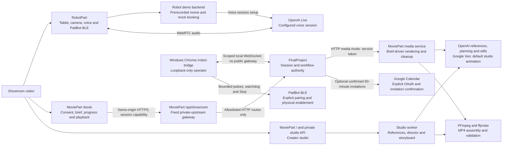

# Magic Pitch Robot

**A showroom conversation becomes a personal product story.**

Magic Pitch Robot (MagicPitch) brings an AI sales experience into the room: a tablet-mounted robot engages a visitor, gathers permitted preferences, presents a short automotive film, and can offer a test-drive follow-up. The project combines Damian's physical robot and voice demo, Dwight's consent-gated orchestration API, and Tiya's Movie Magic creator studio, kiosk, and media service.

The goal is a useful, understandable encounter, not a chatbot attached to a robot. The customer controls what is captured and shared; the interface distinguishes a generated result from a prerecorded or synthetic demonstration.

Movie production runs in the background while the robot continues the showroom conversation. About two minutes is a soft target, not an enforced cutoff. Designers can keep a satisfactory storyboard image and continue instead of paying for repeated cosmetic corrections.

> **Current scope:** the guided showroom connects one authoritative session to the portrait kiosk, consented photo capture, full creator studio, existing OpenAI Live voice, optional Google Calendar invitations, and a separately authorized Windows robot bridge. The safe launcher baseline uses a clearly labelled prerecorded fixture, with paid calls, invitations and physical control disabled. The standalone robot and legacy orchestrator demos remain available. Implemented integrations and offline checks are not a claim of live provider access, iPad certificate trust, observed playback or physical robot safety.

[Architecture and design](docs/architecture.md) | [Trusted HTTPS and operator deployment](docs/showroom-https.md) | [Movie studio and kiosk](MoviePart/README.md) | [Orchestrator](FinalProject/README.md) | [Robot setup](RobotPart/README.md) | [Teammate interfaces](FinalProject/interfaces/v1/README.md)

## The customer experience

1. **Invite and consent.** Explain the experience and obtain permission before uploading a participant image or using personal information.
2. **Understand.** Read back self-reported preferences and explicitly confirm each proposal. Detecting a face is not identifying a stranger. The legacy developer harness retains its separate synthetic roster.
3. **Create.** After informed capture and transfer consent, approve one to four original photos and a real vehicle/template selection, then start one asynchronous full-studio movie job.
4. **Reveal.** Show truthful progress, download the authorized result, and acknowledge reveal only after actual playback.
5. **Follow up or leave.** Optionally confirm the complete recipient, location and 60-minute time readback before a Google Calendar invitation. Disabled or disconnected scheduling is never reported as booked. Ending the session revokes access and initiates local media cleanup; it does not silently cancel a confirmed appointment.

## System architecture



Arrows show implemented component paths, with live providers and physical control independently opt-in. The kiosk calls FinalProject through its same-origin gateway; it never receives studio, provider or operator master credentials. The creator studio remains usable independently, while showroom studio mode submits its immutable, consented inputs through the full studio API and worker. The standalone RobotPart demo is a separate experience, not a second owner of the kiosk session.

See the [detailed design](docs/architecture.md) for sequence diagrams, job lifecycles, credentials, persistence, and cancellation behavior.

## Components and ownership

| Component | Responsibility | Current boundary |
|---|---|---|
| [RobotPart](RobotPart/README.md) - Damian | Tablet UI, local MediaPipe face detection, PadBot BLE control, voice conversation, and showroom workflow | Standalone demo serves a prerecorded MP4 and mock test-drive booking. Its existing capture flow is not automatically the orchestrator's consent flow. |
| [FinalProject](FinalProject/README.md) - Dwight | One-time pairing, authoritative showroom, revision-bound approvals, studio lifecycle, Live SDP setup, scoped bridge intents, calendar and revocation | Explicit fixture/studio modes; independent voice/calendar/bridge opt-ins; legacy roster/brief API preserved |
| [MoviePart](MoviePart/README.md) - Tiya | Creator studio and worker, portrait kiosk, local face/pose capture, fixed gateway, Windows operator page, and legacy media service | One shared session through the private orchestrator; real-vehicle studio and legacy synthetic-concept media contracts remain distinct |
| Original MoviePart - [Edilma](https://github.com/edilma) | Original MoviePart, including the first movie, its assets, and the uploaded video | Original contributions are preserved in the commit history |
| [ResearchSocialMediaPart](ResearchSocialMediaPart/README.md) | Reserved workstream for permitted enrichment | Folder is a placeholder. The implemented optional Exa adapter lives in FinalProject and uses an explicitly supplied profile URL. |
| [OfficeCalendarPart](OfficeCalendarPart/README.md) | Original reserved CRM/calendar workstream | Implementation now lives in `FinalProject/src/calendar`; Google OAuth and confirmed invitations remain explicitly opt-in |
| [OriginalRepo](OriginalRepo/README.md) | Inherited Agents, Everywhere starter kit | Reference material and original examples, not the Magic Pitch Robot runtime |

## Choose the right demo

| Workflow | Entry point | What it demonstrates |
|---|---|---|
| Robot and voice demo | `http://localhost:5173` | Hardware/browser interaction, local face detection, conversation, prerecorded movie, and mock scheduling |
| Orchestrator developer harness | `http://127.0.0.1:3101/dev` | Offline consent/session/job flow with the supplied prerecorded demo; no paid generation required |
| Showroom kiosk | `http://127.0.0.1:3200/kiosk` locally; configured trusted HTTPS on iPad | Portrait face, one-time pairing, guided readbacks, consented references, studio progress, authorized playback and optional scheduling |
| Windows robot operator | `http://127.0.0.1:3200/robot-bridge` on the operator machine | Separate role-code redemption, click-to-pair BLE, explicit physical enablement and Stop; never the iPad/public origin |
| Creator studio | `http://127.0.0.1:3200/` | Independent reference-backed film creation with visible setup requirements |
| Media service | `http://127.0.0.1:3201` | Server-to-server asynchronous rendering; not a browser UI |

Ports are local defaults, not a hosted deployment. The browser and backend must agree on exact origins; `localhost` and `127.0.0.1` are different origins. A separate tablet needs an explicitly configured reachable address, pairing, and trusted HTTPS where browser APIs require it.

The showroom integration gateway is `/api/showroom` on MoviePart: the iPad uses
one trusted HTTPS origin, while FinalProject and studio processes stay private
on loopback. The [deployment guide](docs/showroom-https.md) documents its exact
route allowlist, one-time pairing, Windows-only local operator bridge, and
independent launcher flags. `--ui-port 3202` remains supported; no live voice,
film generation, calendar write or physical enablement is inferred from stored
credentials. The full-studio option runs the creator worker, not the legacy
dedicated media service.

### Start the offline orchestrator

Use **Node.js 24.11.0 and npm 11.6.2** for FinalProject. Each component has its own package and lockfile; there is no root `npm start`.

From the repository root:

```powershell
Set-Location FinalProject
npm ci
npm run verify
$env:ALLOWED_ORIGINS = "http://127.0.0.1:3200"
npm run dev
```

The service defaults to mock providers. Follow [its pairing instructions](FinalProject/README.md#start-locally) for the private device token. Do not paste tokens into chat, URLs, logs, or source control. `/dev` is the synthetic developer harness; it is not the customer kiosk.

### Start Tiya's studio and kiosk

In a second terminal, from the repository root:

```powershell
Set-Location MoviePart
npm ci
if (-not (Test-Path .env)) { Copy-Item .env.example .env }
npm run dev
```

For the integrated `/kiosk`, use the coordinated launcher above instead of
starting unrelated sessions in two demos. The kiosk exchanges a one-time
operator code for its authoritative session; refreshing forgets its in-memory
capability. Standalone studio startup does not itself configure showroom pairing.

For the independent creator studio, also run `npm run worker` in another terminal in `MoviePart`. Edit the private `.env` using [MoviePart's current example](MoviePart/.env.example): the default workflow requires `OPENAI_API_KEY` and `GEMINI_API_KEY`, with explicit model choices shown there. Provide the selected car's authorized references and confirm generation consent before creating a movie. The Create action lists missing requirements; it never silently turns unavailable live generation into mock success.

After editing `.env`, wait for active jobs to finish before restarting the web app and worker. Refreshing the browser alone does not reload credentials. For production, use `npm run build` followed by `npm run start` instead of `npm run dev`; the worker remains a separate process.

For **legacy** orchestrator media rendering, separately run `npm run media-service`
and configure the HTTP media adapter with its private service token. Showroom
`--live-studio` instead runs the full creator worker and never substitutes this
dedicated single-image/brief service. See [the media handoff](MoviePart/README.md#dwight-integration)
before sending participant data.

For hardware operation, follow [RobotPart's prerequisites and start commands](RobotPart/README.md). Bluetooth, camera, microphone, and voice-provider readiness are separate from movie rendering.

## Movie design

Movie Magic builds a controlled film from stable references rather than asking one prompt to invent an entire advertisement. Original photos anchor likeness and vehicle appearance; a structured plan controls narrative and camera direction. The studio defaults to **storyboard approval and Google Veo animation**. Astra generates the plan and Flare generates still images; Veo provides genuine moving footage using a separately configured Google key. Missing animation is not replaced with a slideshow.

| Choice | Behavior |
|---|---|
| Vehicles | Tesla Model Y and Toyota Tundra Hybrid, each requiring its own authorized exterior/interior reference pack. Model 3 reference files are not substituted for Model Y. |
| Templates | Velocity, Tomorrow Drive, Dream Route, and Hero of the Day |
| Classic reference plan | Four reference shots; legacy storyboard-layout output is 18 seconds |
| Tiya's six-beat reference plan | Six reference shots; legacy storyboard-layout output is 23 seconds, or 24 for Hero of the Day |
| Hero modes | `LIKENESS` uses approved customer photos; `POV` and `PERSONALIZED` omit customer photos from provider calls |
| Baseline rendering | Usable scene visuals with pan/zoom, optionally scored with a permitted local audio file; movie-first does not claim continuity approval |
| Default animation | 15-second film: 3-second opening zoom, 8-second Veo clip with native audio, 4-second closing zoom. Both stills come from the clip; no still-only shots in the middle |
| Selectable movie lengths | 13, 15, 18, 23, or 28 seconds, independent of the reference-story format. Longer cuts use two or three generated clips, never repeated footage or intermediate stills |
| Required OpenAI animation | An eight-second Sora car-only clip after storyboard approval; failure blocks the hybrid movie instead of substituting still-image zooms |

The studio's output is a validated 16:9, 720p, 24 fps MP4. `image-motion` identifies movie-first animated-image output; `storyboard-motion` and `hybrid-video` describe reviewed stills or a hybrid with an existing/generated hero clip. These are **not** the orchestrator's result-provenance labels, and animated stills are not fully AI-generated moving footage.

The bookend composition is identified by `renderLayout: "video-bookends"`, with `movie_duration_seconds` selecting its runtime. Each clip's native audio follows its place in the sequence (3–11 seconds for the default 15-second cut); a licensed music bed is optional, not required for generated audio. Approved storyboard references and the director plan remain available even though intermediate still images are not inserted into this cut. Existing movies are not changed when another duration is selected.

Explicit retry preserves approved work, including completed segments of longer movies. Interrupted end-frame preparation can resume before the first video submission; an already submitted video operation is resumed by ID. If a paid submission may have started but its ID is missing, the app blocks blind resubmission rather than repeatedly accepting retries that cannot progress.

Dwight's current `demo-car-v1` brief instead describes an unbranded synthetic concept, with its own scenes, on-screen copy, CTA, and duration. The media service respects that brief; it does not convert it into a Tesla or Toyota advertisement.

## Consent, provenance, and operational limits

- Keep provider keys, pairing capabilities, service tokens, uploaded images, and runtime state private. Copy `.env.example` only when you need a new local configuration; never overwrite an existing credential file blindly.
- `generated`, `mock_fixture`, and `prerendered_fallback` have different meanings and must remain visible in the kiosk. A color-bar fixture is not a film starring the customer.
- A ready file is not proof it played. Tiya's kiosk sends `media_revealed` after actual playback; choose one device to own that acknowledgement.
- Cancellation removes renderer-held work/assets and blocks late resubmission by key. It does not erase a model vendor's retained data or guarantee reversal of a paid submission.
- Face detection is not face recognition. The orchestrator roster is synthetic; do not present it as real enrollment or use images to discover a stranger's identity.
- Local filesystem persistence is not distributed infrastructure. Calendar adapters exist, but live OAuth consent, account access, invitation delivery, hosted deployment and physical end-to-end acceptance remain separate operator verification.

## Validation and documentation

Run commands from the named component directory:

| Component | Local validation |
|---|---|
| MoviePart | `npm run typecheck`, `npm test`, `npm run build` |
| FinalProject | `npm run verify` - typecheck, tests including colocated bridge tests, shared-runtime tests, generated-interface drift, clean production build, and synthetic smoke flow |
| RobotPart | `npm test`, `npm run build` |
| Shared showroom runtime | `npm test` in `packages/showroom-runtime`; also included by FinalProject verification |

Offline tests and encoded fixtures demonstrate software behavior, not live account access, customer likeness quality, physical robot safety, or human-observed playback.
MoviePart's default tests include its colocated operator controller tests.
FinalProject's clean production build excludes colocated test modules, including
stale outputs from earlier builds.

- [Architecture and interaction design](docs/architecture.md)
- [Movie studio setup and pipeline](MoviePart/README.md)
- [Vehicle reference preparation](MoviePart/demo-data/README.md)
- [Teammate contracts and examples](FinalProject/interfaces/v1/README.md)
- [Orchestrator operations runbook](FinalProject/docs/runbook.md)
- [Robot backend and workflow](RobotPart/server/README.md)

## Project origin

Built for the AI Tinkerers **Agents, Everywhere** hackathon in Miami by the Agent-RedHat team. The inherited starter remains under [OriginalRepo](OriginalRepo/README.md), including [event guidance](OriginalRepo/hackathon-overview.md), [rules](OriginalRepo/hackathon-rules.md), and [sponsor setup references](OriginalRepo/using-sponsor-tools.md). Those starter examples and integrations are not claims about what the Magic Pitch Robot currently executes.
