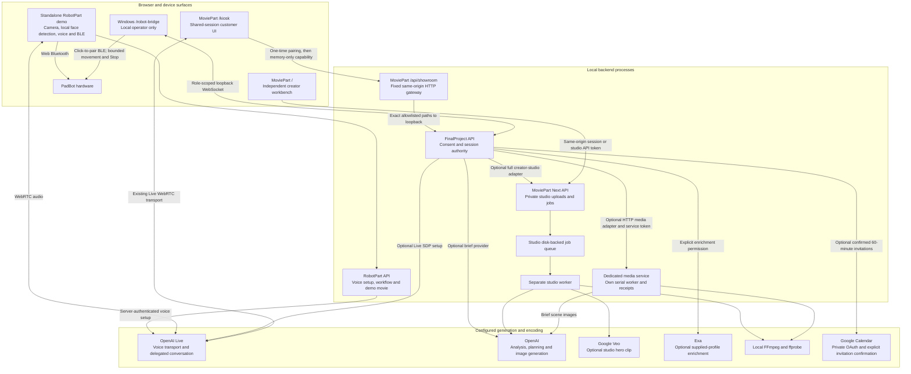
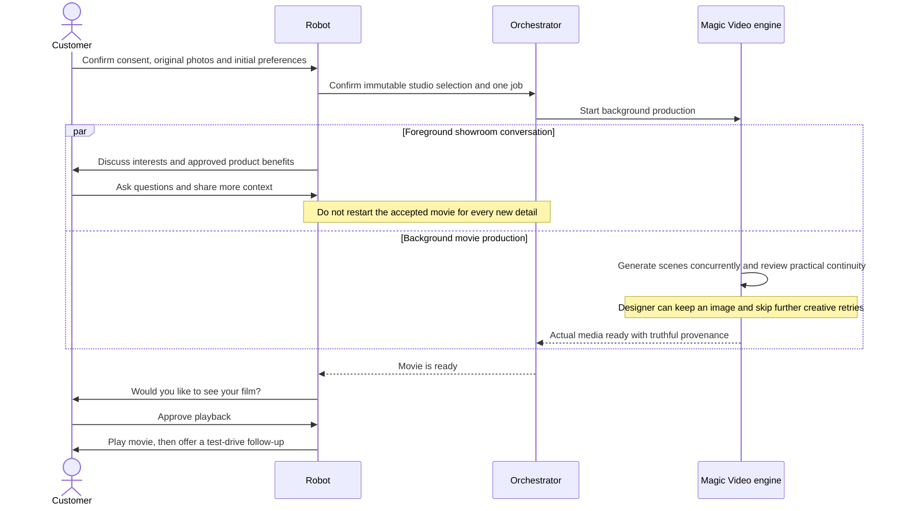
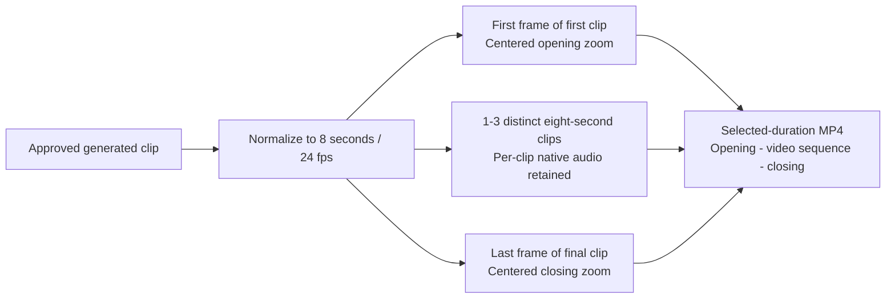
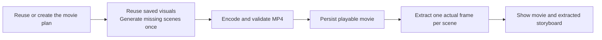
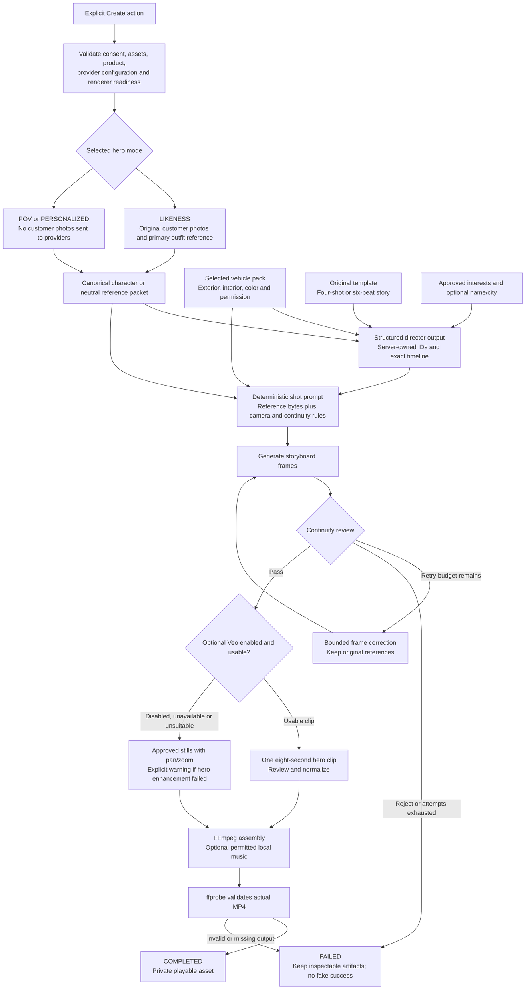
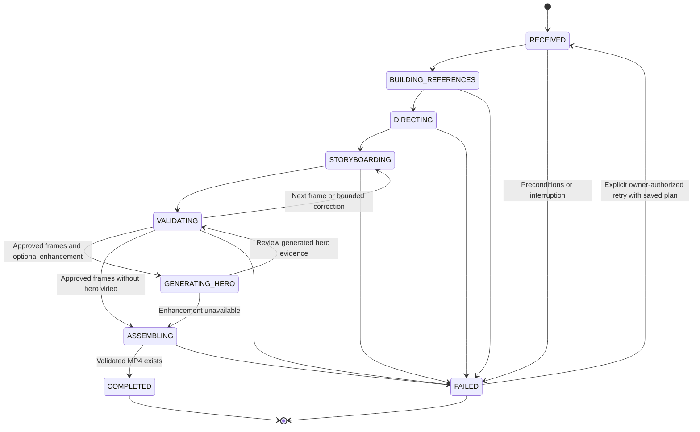
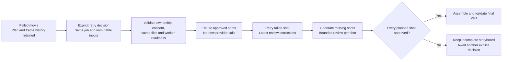

# Magic Pitch Robot: architecture and design

This document describes the implementation in this repository and the boundaries needed to assemble the showroom experience. It does not assume another worktree's launcher, a running local process, or a deployed cloud service is available.

[Project overview](../README.md) | [Trusted HTTPS and operator setup](showroom-https.md) | [MoviePart setup](../MoviePart/README.md) | [Showroom contracts](../FinalProject/docs/showroom-contracts.md)

## 1. Design principles

**Consent before data movement.** Camera permission, permission to generate a likeness, and permission to enrich a profile are different decisions. Enforce the relevant decision at the API boundary, not only in a prompt or checkbox.

**One session, one conversation.** Robot and kiosk integrations must share the same orchestrator session. Its capability authorizes access; a session ID alone does not.

**Plan before rendering.** The creator studio reuses canonical character and product references, a constrained template, and a validated shot plan. Visual review can request a bounded retry; it is not biometric identity verification.

**Acknowledge real outcomes.** Accepting a job, producing a valid file, playing it, and deleting it are separate outcomes. Each has its own state and evidence.

**Separate demos from live operations.** Synthetic fixtures, prerecorded fallback, live generation, and mock booking must never be interchangeable labels.

## 2. Runtime boundaries



The two MoviePart execution paths share a project, not a job contract:

| Path | Input and authority | Rendering behavior |
|---|---|---|
| Creator studio, including showroom studio mode | Immutable MoviePart request, approved interests, one to four original photos, selected template and real vehicle references | Complete references/director/storyboard/video pipeline and validated assembly; no dedicated image-engine substitution |
| Legacy orchestrator media service | Dwight's complete `AdBrief` and consented PNG/JPEG, submitted by his backend | Uses the brief's scenes, durations, copy and CTA to render the legacy synthetic concept MP4 |

The media service does not invoke the studio director to replace the incoming brief. It also does not turn `demo-car-v1` into the studio's Tesla Model Y or Toyota Tundra Hybrid.

Both voice backends reuse the shared RobotPart Live request/transport: FinalProject
sets up the authoritative showroom session, while the standalone demo retains
its own workflow. Only validated SDP and opaque voice-session identifiers reach
the browser. Local face/pose detection does not mean Live voice processing is offline.

## 3. Kiosk and orchestrator interaction

The portrait customer kiosk combines the green/lime face, guided consent and
readbacks, quiet one-to-four-photo capture, honest studio progress, playback,
and optional scheduling. The operator issues a short-lived one-time code
locally; the kiosk never accepts an operator/device master token.

The robot's conversation and the movie's production are concurrent. Start the background job when the minimum consented inputs are ready, not after the entire sales conversation ends. Keep the accepted input snapshot stable while the conversation continues.



Approximately two minutes is an advisory experience target. The studio's elapsed-time display never cancels work or selects fallback media at that threshold. Operational safety limits are separate: the orchestrator defaults to a 30-minute session and a 15-minute job timeout, while the dedicated MoviePart service defaults to a configurable 10-minute job timeout. Existing `.env` overrides and already-running processes retain their configured limits until deliberately changed/restarted.

The authoritative showroom uses `POST /v1/kiosk/pair`, session `/showroom`
snapshots, revision/event-ID-bound `/showroom/actions`, and separately owned
raw reference uploads. Every proposal has an explicit readback and fingerprint
before confirmation. Studio transfer/job receipts reconcile uncertain requests;
fixture mode instead uses the registered prerecorded film with `mock_fixture`
provenance. Voice and an unpaired robot do not gate stationary consented capture.

**The sequence below documents the preserved legacy brief/developer-client
path, not the portrait showroom API.** The current route matrix is in the
[showroom contracts](../FinalProject/docs/showroom-contracts.md).

```mermaid
sequenceDiagram
    actor Customer
    participant UI as Tiya kiosk
    participant O as Dwight orchestrator
    participant M as Tiya media service

    Note over UI,O: Pair a new session or join the robot's existing session through a trusted bridge
    UI->>O: POST /v1/sessions with device token
    O-->>UI: sessionId, sessionToken, serverInstanceId
    Customer->>UI: Review and confirm consent
    UI->>O: POST session events: consent_recorded
    UI->>O: Identify permitted synthetic roster entry
    UI->>O: POST session events: context_updated
    UI->>O: POST commands/create_ad_brief
    O-->>UI: AdBrief with scenes, copy, CTA and total duration
    Customer->>UI: Review brief and permit photo upload
    UI->>O: POST session assets: raw PNG or JPEG
    UI->>O: POST commands/start_media_job with stable client key
    O-->>UI: Session media job

    alt HTTP media mode selected
        O->>M: GET /capabilities with service token
        M-->>O: Validated cancellation and asset-deletion capabilities
        O->>M: POST /jobs with globally unique job ID as idempotency key
        M-->>O: providerJobId before rendering completes
        loop Until terminal state or deadline
            O->>M: GET /jobs/providerJobId
            M-->>O: queued, running, failed or ready
        end
        O->>M: GET relative assets/render-id.mp4
        M-->>O: Valid MP4 bytes
        O->>M: DELETE /jobs/by-key/jobId with independent cleanup deadline
        M-->>O: cancelled, assetsDeleted true after cleanup
        Note over O: Store authorized result; expose ready only after successful cleanup
    else Default mock media mode
        Note over O: Use the registered prerecorded demo; do not contact the media service
    end

    UI->>O: GET snapshot afterRevision or GET session job
    O-->>UI: Ready result with provenance and asset metadata
    UI->>O: GET session asset with session capability
    O-->>UI: Authorized MP4 bytes
    Note over UI: Verify bytes and checksum; create a Blob URL
    Customer->>UI: Play movie
    UI->>O: POST session events: media_revealed after actual playback
```

This is the successful path. Any provider failure, expiry, cancellation, invalid output, or unsuccessful cleanup must produce an explicit non-success state. On network uncertainty, retry reads or reconcile the existing job; do not automatically submit a second paid generation.

The kiosk uses `Authorization` for downloads because an HTML video element cannot attach a bearer header by itself. Blob URLs are revoked when replaced, when permission/session validity is lost, and when the view is disposed.

Legacy snapshots use a revision cursor and `resetRequired`; showroom snapshots
are whole-state reads with distinct snapshot/input revisions. A changed
`serverInstanceId`, expired session or revoked capability invalidates local
state rather than silently pairing another customer. Stop and consent
withdrawal bypass queued provider work without bypassing authentication.

## 4. Creator-studio filmmaking pipelines

The web studio defaults to reviewed storyboards and a required Google Veo clip. Astra handles reference analysis and direction; Flare handles stills; a separate Google key authorizes Veo animation. Explicit `video_provider` selection requires an actual clip before hybrid assembly, never a slideshow fallback. When the temporary OpenAI Sora adapter is explicitly selected instead, its hero is car-only because that API rejects human-face references. DaVinci API integration remains unverified and is not represented as working.

The studio selects `render_layout: "video-bookends"` with `movie_duration_seconds` set independently of the reference-story format: 13, 15 (default), 18, 23, or 28 seconds. The approved four/six-shot plan remains reference material; only two extracted video frames become still segments. The middle is entirely generated footage, with one to three eight-second clips and separately aligned native audio. A continuation is conditioned on the preceding approved video's final frame. Sora bookend movies are entirely car-only, including their extracted stills. API callers omitting the layout keep the legacy storyboard sequence.



Movie-first remains an explicitly selected image-motion alternative, illustrated below. Existing API callers that omit `production_mode` retain reviewed-storyboard behavior. A failed image-only job can explicitly switch to movie-first; an OpenAI hybrid request cannot silently downgrade to it.



Movie-first skips the continuity critic; it does not mark unreviewed images as approved. Intermediate visuals are saved privately as scene inputs. Only after encoding does the displayed storyboard populate with `source: extracted`, a timestamp, and `NOT_REVIEWED` metadata. An extraction-only failure preserves the MP4 and can resume without more model calls. In the current image-provider setup, the film is accurately labeled animated-image output, not fully generated moving footage.

The following diagram describes the **legacy storyboard-layout path** for callers that leave the video provider optional. The studio's required-video bookend path above does not substitute stills when animation is unavailable:



Original photo bytes remain primary identity references in likeness mode. Product references accompany storyboard generation; text descriptions supplement them rather than inventing a replacement vehicle. In first-person/generic-driver modes, even supplied customer images and appearance notes must not leak into provider payloads.

### Timeline contract

The following are reference-plan timelines and legacy storyboard-layout output timings. `getRenderTimeline` derives the selected bookend output without rewriting the director plan: **2+8+3=13**, **3+8+4=15**, **1+8+8+1=18**, **3+8+8+4=23**, or **2+8+8+8+2=28**. The source hero remains `shot_03` or `shot_04`; ordered `videoSegments` checkpoints distinguish its continuations and their paid-operation boundaries.

| Format | Shot durations in seconds | Total | Optional hero |
|---|---|---|---|
| Classic | 3, 3, 8, 4 | 18 seconds | `shot_03` |
| Six-shot Velocity, Tomorrow Drive, or Dream Route | 3, 3, 2, 8, 3, 4 | 23 seconds | `shot_04` |
| Six-shot Hero of the Day | 3, 3, 3, 8, 3, 4 | 24 seconds | `shot_04` |

Templates are original narrative structures, not recreations of recognizable film scenes. Tiya's six beats are **ordinary moment, spark, crossing over, impossible/journey, mastery, payoff**. The story can change environment intentionally, but not randomly change its protagonist or vehicle.

Frame generation is bounded; a failed real request does not become mock output. Studio continuity checks supplement human review. Generated likeness quality, vehicle fidelity, and account-specific moderation still need live acceptance with the consenting participant.

## 5. Job and cleanup lifecycle



This diagram uses **studio** status names. The media-service wire protocol uses `queued`, `running`, `ready`, and `failed`, with finer progress stages; it must not return a studio status to Dwight.

### Explicit studio recovery

`POST /api/movie-jobs/{jobId}/retry` atomically requeues an eligible failed job with its original ID and a durable retry receipt. The request contains an idempotency key and the expected retry counter. Duplicate delivery returns the existing receipt; a stale counter cannot trigger another paid attempt.



The worker reuses saved character analysis and the director plan. Every new approval is checkpointed before progressing, so a second failure still preserves prior work. A previously attempted optional hero video is not resubmitted merely because final assembly is being retried. Missing approved media blocks the retry rather than silently regenerating it. This recovery endpoint is separate from the media service's cancellation and tombstone protocol.

Required Veo retries resume the recorded Google operation, skipping endpoint generation and new video submission. Download and continuity validation can run again against that existing output; validation failures retain their actionable provider error instead of being replaced by a generic missing-animation message.

For longer cuts, each `videoSegments` entry separately checkpoints its submission guard, operation ID, continuation-frame asset, and approved clip. A known operation can be recovered even if the segment checkpoint was interrupted after the global operation receipt. Completed clips are never regenerated on retry; an uncertain paid submission without an ID blocks new submissions. The existing creator-studio endpoints carry these additive duration/progress fields; no parallel generation API is introduced.

### Designer authority and practical approval

Runtime storyboard generation defaults to two concurrent shots and up to eight image attempts per unapproved shot. Practical continuity accepts minor texture, prop-position and nonessential background differences while protecting subject identity, the selected product, required actions and safety. A failed creative review can prompt a different camera/framing composition without changing the immutable references or story.

`POST /api/movie-jobs/{jobId}/frames/{assetId}/decision` records an owned, revision-checked `keep` or `regenerate` decision plus a designer note. A kept frame is accepted because the designer chose it; its original AI verdict remains unchanged. Selecting an older candidate marks other candidates unselected rather than deleting their evidence. Regeneration invalidates prior approvals for that shot and supplies the note as correction data.

The worker checks for designer choices before new attempts and after review. It atomically locks the selected approved storyboard before animation/rendering; API decisions cannot race a completed film into using a rejected frame. Provider-side content restrictions, valid-media checks and consent are never overridden by creative approval.

Newly generated characters use the requested subtly slimmer presentation, disclosed in the consent UI. Original reference observations, source photos, face/hair/clothing identity, and designer-kept frames remain unchanged. That intentional mild presentation difference is not itself a continuity failure.

```mermaid
sequenceDiagram
    participant O as Orchestrator
    participant M as Media service
    participant W as Active renderer
    participant D as Private disk store

    O->>M: DELETE /jobs/by-key/jobId
    M->>D: Persist cancellation tombstone even if POST has not arrived
    M->>W: Abort work and await settlement
    W-->>M: No renderer work remains
    M->>D: Remove uploaded image, brief, intermediates and result
    D-->>M: Cleanup verified
    M-->>O: cancelled, assetsDeleted true
    O->>M: Delayed POST with the same jobId
    M-->>O: Reject cancelled key; do not restart generation
```

If settlement or deletion times out, the service retains a pending cleanup receipt and returns an error, not `assetsDeleted: true`. A fresh, bounded cleanup signal is independent of the aborted rendering signal. Model-vendor retention and already-submitted charges are outside local deletion guarantees.

## 6. Contracts, credentials, and persistence

| Boundary | Credential | Contract and state |
|---|---|---|
| Local operator -> kiosk pairing issuance | Private operator bootstrap token | Issues a short-lived one-time code; never forwarded through the public gateway |
| Kiosk code exchange -> FinalProject | One-time code only | Returns a session capability held in memory, never a query/cookie/public bundle |
| Kiosk -> showroom routes/assets | Session token through the fixed gateway | Versioned snapshots, confirmed actions, scoped original photos and authorized movie |
| FinalProject -> media service | `MEDIA_SERVICE_TOKEN`, server-only | Global job UUID is both body/header idempotency key; changed-payload reuse is rejected |
| Studio browser -> MoviePart API | HTTP-only same-origin session cookie | Private uploads and jobs tied to that browser principal |
| Studio machine client -> MoviePart API | `MOVIE_API_TOKEN` | Separate principal; not interchangeable with the media-service token |
| Backend -> model provider | Private provider API key | Never embedded in browser code, downloaded contracts, or generated docs |
| FinalProject -> Google Calendar | Private OAuth client/refresh credentials | One confirmed 60-minute draft and stable event ID; invitation receipt does not prove inbox delivery |
| Local Windows bridge -> FinalProject | Separate redeemed operator/bridge role credentials | Fixed local WebSocket, lease generation, bounded pulses, watchdog and truthful Stop acknowledgements |

| Store | Lifetime and restart behavior |
|---|---|
| FinalProject sessions/jobs/assets | In-memory and bounded; process restart discards sessions. Re-pairing is explicit. |
| Studio `.movie-data` | Disk-backed uploads, manifests, artifacts and idempotency records. Separate worker claims jobs atomically. Interrupted paid work is not blindly repeated. |
| Media-service private work directory | Image, brief, scene frames and MP4 retained until cleanup; no public static-file directory |
| Media-service receipts | Minimal IDs, request fingerprint and cleanup state survive restart for deduplication and reconciliation |
| Browser Blob URLs | Temporary authorized playback resources, released when no longer needed |
| Calendar OAuth/booking receipts | Private durable stores; session/photo cleanup does not cancel an appointment |
| Studio cleanup receipts | Durable transfer/job keys; startup reconciles unfinished cleanup without another paid submission |

The creator studio now has its own active-cancellation and upload/job receipt
endpoints. It waits for owned worker/provider/encoder settlement before claiming
local deletion and prevents delayed requests from reviving cancelled work.
These remain distinct from the legacy media-service cancellation protocol;
neither can promise to erase provider-retained data or reverse accepted charges.

Ready-result provenance is also distinct from encoding mode:

- `generated`: output from the real configured media adapter, not proof that a real production vehicle appears.
- `mock_fixture`: explicitly synthetic demonstration media, not the participant.
- `prerendered_fallback`: prerecorded fallback, visibly labeled.
- `storyboard-motion` / `hybrid-video`: studio assembly modes, not authenticity claims.

## 7. Deployment and completion boundaries

- Default local ports are robot UI **5173**, robot development API **8787**, orchestrator **3101**, studio/kiosk **3200**, and media service **3201**.
- The Windows showroom tablet uses `/kiosk` and one fixed same-origin `/api/showroom`; all service ports remain loopback. A separate customer display still needs exact origins, certificate trust and a restricted proxy configured explicitly. Do not expose studio/operator/OAuth/bridge-control routes with a bare tunnel.
- The standalone RobotPart keeps its own prerecorded/mock-booking demo. The showroom reuses its Live/vision/PadBot modules with one FinalProject session and a separate loopback Windows operator page for Web Bluetooth; public or tunneled origins cannot control the robot.
- `demo-car-v1` remains a legacy synthetic contract. Real-vehicle showroom orchestration uses the separate immutable studio contract, not a synthetic-product alias.
- Calendar execution is implemented under `FinalProject/src/calendar`; Google OAuth and invitations are independent opt-ins. ResearchSocialMediaPart and OfficeCalendarPart remain original workstream folders.
- No distributed queue, cloud deployment, live account access or confirmed invitation delivery is asserted by these diagrams.
- Automated HTTP/encoding checks are separate from physical safety, live-provider acceptance, visual fidelity, and customer-observed playback.

## Source map

| Design surface | Implementation or contract |
|---|---|
| Showroom kiosk and authorized gateway client | [Controller](../MoviePart/src/kiosk/showroom-controller.ts), [client](../MoviePart/integration/showroom-client.ts), [gateway](../MoviePart/src/server/showroom-gateway.ts) |
| Legacy brief-client compatibility | [Controller](../MoviePart/src/kiosk/controller.ts), [client](../MoviePart/integration/orchestrator-client.ts) |
| Session workflow and provider selection | [Orchestrator](../FinalProject/src/orchestrator/service.ts), [configuration](../FinalProject/src/config.ts) |
| Guided approvals and full-studio adapter | [Showroom](../FinalProject/src/orchestrator/showroom.ts), [adapter](../FinalProject/src/providers/studio.ts) |
| Calendar and local operator safety | [Calendar](../FinalProject/docs/google-calendar.md), [bridge](../FinalProject/src/bridge/README.md) |
| Studio pipeline and templates | [Pipeline](../MoviePart/src/pipeline.ts), [templates](../MoviePart/src/templates/index.ts) |
| Studio worker and persistence | [Worker](../MoviePart/src/jobs/worker.ts), [store](../MoviePart/src/jobs/store.ts) |
| Media-service acceptance and cleanup | [Service](../MoviePart/src/media-service/service.ts), [HTTP](../MoviePart/src/media-service/http.ts) |
| Brief-driven encoding and on-screen copy | [Executor](../MoviePart/src/media-service/executor.ts), [renderer](../MoviePart/src/media-service/render.ts) |
| Hardware/browser demo | [Robot UI](../RobotPart/src/main.jsx), [PadBot protocol](../RobotPart/RobotLibrary/README.md) |
| Portable teammate handoff | [Showroom schemas/OpenAPI](../FinalProject/interfaces/showroom-v1/README.md), [legacy v1](../FinalProject/interfaces/v1/README.md) |
